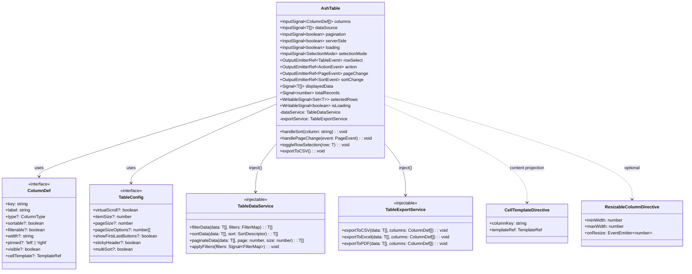
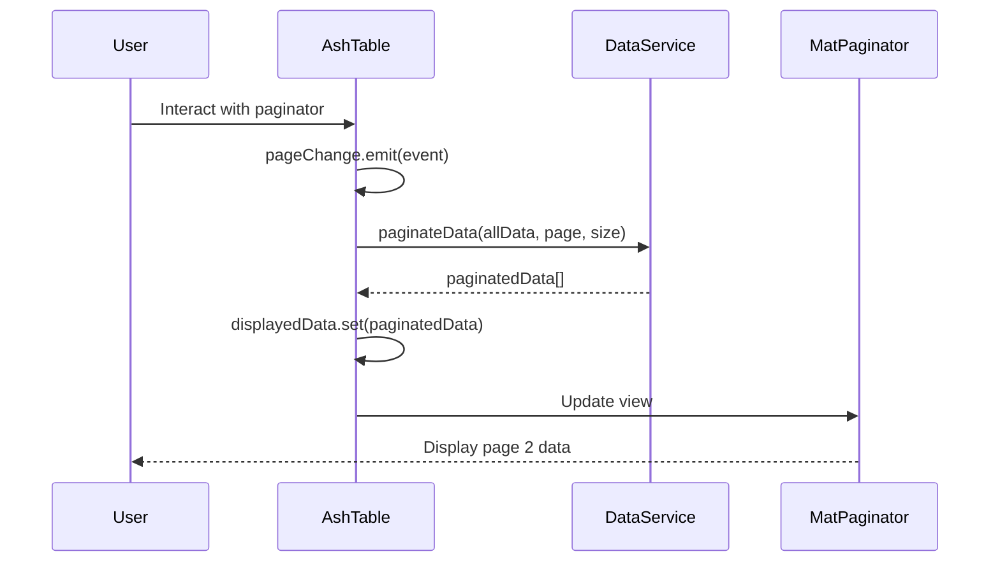
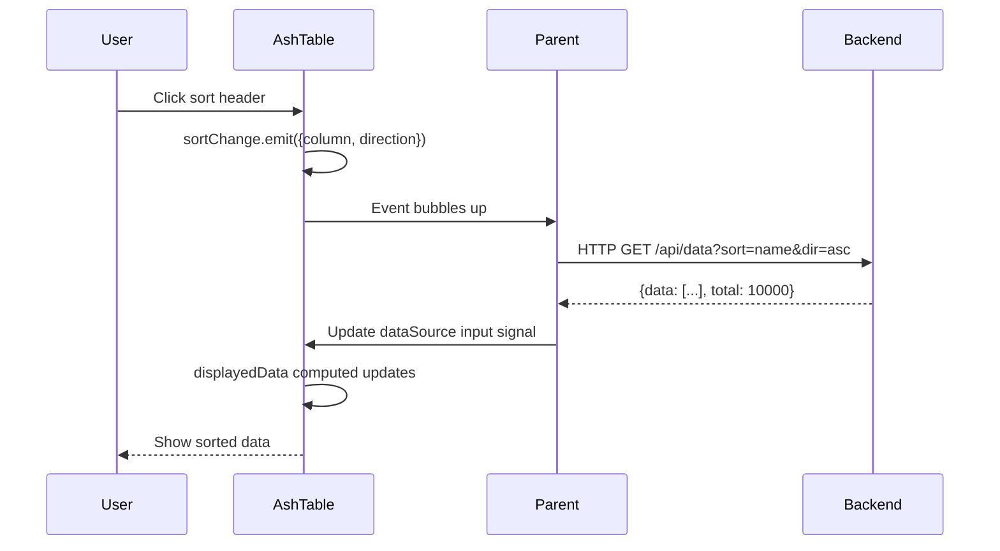
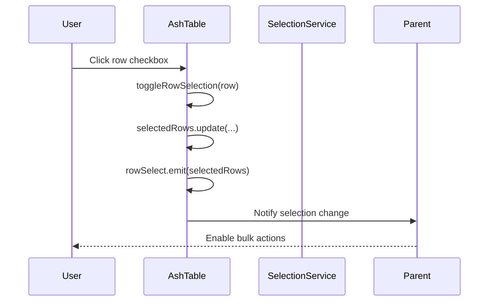
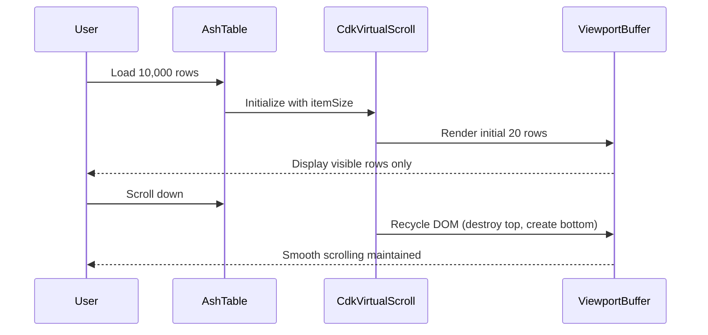

# AshTable Component - Design Document

**Version:** 1.0  
**Created:** January 18, 2026  
**Component:** AshTable  
**Library:** ash-ui-lib  
**Framework:** Angular 20+

---

## Table of Contents

1. [Architecture Overview](#architecture-overview)
2. [Component Structure](#component-structure)
3. [Class Diagram](#class-diagram)
4. [Sequence Diagrams](#sequence-diagrams)
5. [Interface Definitions](#interface-definitions)
6. [Component API](#component-api)
7. [Usage Guide](#usage-guide)
8. [Theming Implementation](#theming-implementation)
9. [Best Practices Alignment](#best-practices-alignment)
10. [Performance Considerations](#performance-considerations)
11. [Accessibility Implementation](#accessibility-implementation)

---

## Architecture Overview

### Design Philosophy

AshTable is a **standalone, signal-based** enterprise table component built on Angular Material CDK. It adopts OnPush change detection and modern Angular patterns (signals, computed values, built-in control flow) for optimal performance.

### Core Layers

```
┌─────────────────────────────────────────────────┐
│           AshTable Component                     │
│  (Presentation + State Management via Signals)  │
└─────────────────┬───────────────────────────────┘
                  │
         ┌────────┴────────┐
         │                 │
    ┌────▼─────┐    ┌─────▼──────┐
    │ Material │    │ CDK Virtual│
    │  Table   │    │  Scrolling │
    └──────────┘    └────────────┘
```

### Key Dependencies

- `@angular/material/table` - Base table functionality
- `@angular/cdk/scrolling` - Virtual scrolling
- `@angular/material/paginator` - Pagination UI
- `@angular/material/sort` - Sorting functionality
- `@angular/material/checkbox` - Row selection

---

## Component Structure

### File Organization

```
projects/ash-ui-lib/src/lib/ash-table/
├── ash-table.ts                    # Main component
├── ash-table.html                  # Template (built-in @if/@for)
├── ash-table.scss                   # Component styles
├── ash-table.spec.ts               # Unit tests
├── models/
│   ├── column-def.model.ts         # Column configuration interface
│   ├── table-config.model.ts       # Table configuration
│   └── table-event.model.ts        # Event payload types
├── services/
│   ├── table-data.service.ts       # Data management (injectable)
│   └── table-export.service.ts     # Export functionality
└── directives/
    ├── cell-template.directive.ts  # Custom cell templates
    └── resizable-column.directive.ts # Column resizing
```

---

## Class Diagram



---

## Sequence Diagrams

### 1. Client-Side Pagination Flow



### 2. Server-Side Sorting/Filtering Flow



### 3. Row Selection Flow



### 4. Virtual Scrolling with 10K+ Rows



---

## Interface Definitions

### Core Interfaces

```typescript
/**
 * Column configuration for table display
 */
export interface ColumnDef<T = any> {
  /** Unique identifier matching data property key */
  key: keyof T & string;
  
  /** Human-readable column header */
  label: string;
  
  /** Data type for formatting (default: 'string') */
  type?: 'string' | 'number' | 'date' | 'currency' | 'boolean';
  
  /** Enable column sorting (default: false) */
  sortable?: boolean;
  
  /** Enable column filtering (default: false) */
  filterable?: boolean;
  
  /** Fixed column width (CSS value) */
  width?: string;
  
  /** Pin column to left or right */
  pinned?: 'left' | 'right';
  
  /** Column visibility toggle (default: true) */
  visible?: boolean;
  
  /** Custom cell template reference */
  cellTemplate?: TemplateRef<CellContext<T>>;
  
  /** Format function for cell value */
  format?: (value: any) => string;
  
  /** CSS class for column cells */
  cssClass?: string;
}

/**
 * Table configuration options
 */
export interface TableConfig {
  /** Enable CDK virtual scrolling for large datasets */
  virtualScroll?: boolean;
  
  /** Row height in pixels (required for virtual scroll) */
  itemSize?: number;
  
  /** Default page size for initial load */
  defaultPageSize?: number;
  
  /** Available page size options */
  pageSizeOptions?: number[];
  
  /** Show first/last page buttons in paginator */
  showFirstLastButtons?: boolean;
  
  /** Sticky table header on scroll */
  stickyHeader?: boolean;
  
  /** Enable multi-column sorting (Shift+Click) */
  multiSort?: boolean;
  
  /** Enable column resizing */
  resizableColumns?: boolean;
  
  /** Enable column reordering via drag-drop */
  reorderableColumns?: boolean;
  
  /** Track by function for row identity */
  trackBy?: (index: number, item: any) => any;
}

/**
 * Row selection modes
 */
export type SelectionMode = 'none' | 'single' | 'multi';

/**
 * Filter descriptor for column filtering
 */
export interface FilterDescriptor {
  field: string;
  operator: 'contains' | 'equals' | 'startsWith' | 'endsWith' | 'gt' | 'lt';
  value: any;
}

/**
 * Sort descriptor
 */
export interface SortDescriptor {
  column: string;
  direction: 'asc' | 'desc' | '';
}

/**
 * Page event payload
 */
export interface PageEvent {
  pageIndex: number;
  pageSize: number;
  previousPageIndex?: number;
  length: number;
}

/**
 * Table action event
 */
export interface ActionEvent<T = any> {
  action: string;
  row: T;
  rowIndex: number;
}

/**
 * Row selection event
 */
export interface SelectionEvent<T = any> {
  selected: T[];
  added: T[];
  removed: T[];
}

/**
 * Cell template context
 */
export interface CellContext<T = any> {
  $implicit: T;
  row: T;
  column: ColumnDef<T>;
  rowIndex: number;
  value: any;
}
```

---

## Component API

### Inputs (Signal-based)

```typescript
/** Column definitions array */
columns = input.required<ColumnDef[]>();

/** Table data source (array or Observable) */
dataSource = input<any[]>([]);

/** Enable pagination UI */
pagination = input<boolean>(true);

/** Server-side mode (disables client-side processing) */
serverSide = input<boolean>(false);

/** Loading state indicator */
loading = input<boolean>(false);

/** Row selection mode */
selectionMode = input<SelectionMode>('none');

/** Total records (for server-side pagination) */
totalRecords = input<number>(0);

/** Table configuration */
config = input<TableConfig>({
  defaultPageSize: 25,
  pageSizeOptions: [10, 25, 50, 100],
  virtualScroll: false,
  stickyHeader: true
});

/** Current page index (for server-side) */
currentPage = input<number>(0);

/** Current sort state (for server-side) */
currentSort = input<SortDescriptor | null>(null);

/** Applied filters (for server-side) */
appliedFilters = input<FilterDescriptor[]>([]);

/** Error state */
error = input<boolean>(false);

/** Error message to display */
errorMessage = input<string>('An error occurred while loading data');
```

### Outputs (Signal-based)

```typescript
/** Row selection change event */
rowSelect = output<SelectionEvent>();

/** Row action triggered (edit, delete, view, etc.) */
action = output<ActionEvent>();

/** Page change event */
pageChange = output<PageEvent>();

/** Sort change event */
sortChange = output<SortDescriptor>();

/** Filter change event */
filterChange = output<FilterDescriptor[]>();

/** Column visibility change */
columnsChange = output<ColumnDef[]>();

/** Column resize event */
columnResize = output<{column: string; width: number}>();

/** Export initiated */
exportData = output<{format: 'csv' | 'excel' | 'pdf'}>();
```

### Public Methods

```typescript
/** Clear all selections */
clearSelection(): void;

/** Select all visible rows */
selectAll(): void;

/** Deselect specific row(s) */
deselectRows(rows: T[]): void;

/** Get currently selected rows */
getSelectedRows(): T[];

/** Refresh data (re-emit requests for server-side) */
refresh(): void;

/** Reset table state (filters, sort, pagination) */
reset(): void;

/** Export visible data */
exportToCSV(): void;
exportToExcel(): void;
exportToPDF(): void;

/** Get current table state */
getState(): TableState;

/** Restore table state */
setState(state: TableState): void;
```

---

## Usage Guide

### Basic Usage (Client-Side)

```typescript
import { Component, signal } from '@angular/core';
import { AshTable } from '@yourscope/ash-ui-lib';

@Component({
  selector: 'app-customers',
  imports: [AshTable],
  template: `
    <lib-ash-table
      [columns]="columns()"
      [dataSource]="customers()"
      [pagination]="true"
      [selectionMode]="'multi'"
      (rowSelect)="onSelectionChange($event)"
      (action)="onAction($event)"
    />
  `
})
export class CustomersComponent {
  protected readonly columns = signal([
    { key: 'id', label: 'ID', type: 'number', sortable: true },
    { key: 'name', label: 'Customer Name', sortable: true, filterable: true },
    { key: 'email', label: 'Email', filterable: true },
    { key: 'revenue', label: 'Revenue', type: 'currency', sortable: true }
  ]);

  protected readonly customers = signal([
    { id: 1, name: 'Acme Corp', email: 'contact@acme.com', revenue: 125000 },
    { id: 2, name: 'TechStart Inc', email: 'info@techstart.com', revenue: 89000 }
  ]);

  protected onSelectionChange(event: SelectionEvent) {
    console.log('Selected:', event.selected);
  }

  protected onAction(event: ActionEvent) {
    if (event.action === 'edit') {
      this.editCustomer(event.row);
    }
  }
}
```

### Server-Side Pagination

```typescript
import { Component, signal, effect } from '@angular/core';
import { HttpClient } from '@angular/common/http';

@Component({
  selector: 'app-customers-server',
  imports: [AshTable],
  template: `
    <lib-ash-table
      [columns]="columns()"
      [dataSource]="data()"
      [serverSide]="true"
      [loading]="loading()"
      [totalRecords]="totalRecords()"
      [currentPage]="currentPage()"
      [currentSort]="currentSort()"
      (pageChange)="onPageChange($event)"
      (sortChange)="onSortChange($event)"
      (filterChange)="onFilterChange($event)"
    />
  `
})
export class CustomersServerComponent {
  private readonly http = inject(HttpClient);
  
  protected readonly columns = signal([...]);
  protected readonly data = signal([]);
  protected readonly loading = signal(false);
  protected readonly totalRecords = signal(0);
  protected readonly currentPage = signal(0);
  protected readonly currentSort = signal<SortDescriptor | null>(null);
  protected readonly filters = signal<FilterDescriptor[]>([]);

  constructor() {
    // Auto-fetch when any parameter changes
    effect(() => {
      this.fetchData();
    });
  }

  protected onPageChange(event: PageEvent) {
    this.currentPage.set(event.pageIndex);
  }

  protected onSortChange(sort: SortDescriptor) {
    this.currentSort.set(sort);
  }

  protected onFilterChange(filters: FilterDescriptor[]) {
    this.filters.set(filters);
  }

  private fetchData() {
    const page = this.currentPage();
    const sort = this.currentSort();
    const filters = this.filters();
    
    this.loading.set(true);
    this.http.get('/api/customers', {
      params: {
        page: page.toString(),
        sort: sort?.column || '',
        direction: sort?.direction || '',
        filters: JSON.stringify(filters)
      }
    }).subscribe(response => {
      this.data.set(response.data);
      this.totalRecords.set(response.total);
      this.loading.set(false);
    });
  }
}
```

### Custom Cell Templates

```typescript
@Component({
  template: `
    <lib-ash-table
      [columns]="columns()"
      [dataSource]="data()"
    >
      <!-- Custom cell template -->
      <ng-template libCellTemplate columnKey="status" let-row>
        <span [class]="'status-badge status-' + row.status">
          {{ row.status }}
        </span>
      </ng-template>

      <!-- Action buttons template -->
      <ng-template libCellTemplate columnKey="actions" let-row let-index="rowIndex">
        <button mat-icon-button (click)="editRow(row)">
          <mat-icon>edit</mat-icon>
        </button>
        <button mat-icon-button (click)="deleteRow(row, index)">
          <mat-icon>delete</mat-icon>
        </button>
      </ng-template>
    </lib-ash-table>
  `
})
```

### Virtual Scrolling (10K+ Rows)

```typescript
@Component({
  template: `
    <lib-ash-table
      [columns]="columns()"
      [dataSource]="largeDataset()"
      [config]="{
        virtualScroll: true,
        itemSize: 48,
        pagination: false
      }"
    />
  `
})
export class LargeDataComponent {
  protected readonly largeDataset = signal(
    Array.from({ length: 10000 }, (_, i) => ({
      id: i + 1,
      name: `Customer ${i + 1}`,
      value: Math.random() * 100000
    }))
  );
}
```

### With Inline Actions

```typescript
protected readonly columns = signal([
  { key: 'name', label: 'Name', sortable: true },
  { key: 'email', label: 'Email' },
  {
    key: 'actions',
    label: 'Actions',
    type: 'actions',
    actions: [
      { icon: 'edit', label: 'Edit', action: 'edit' },
      { icon: 'delete', label: 'Delete', action: 'delete', color: 'warn' },
      { icon: 'visibility', label: 'View', action: 'view' }
    ]
  }
]);
```

---

## Theming Implementation

### Overview

AshTable implements **Material Design 3 (v19+)** theming using Material's system tokens (`--mat-sys-*`). This modern approach eliminates the need for `mat.define-theme()` while providing automatic theme inheritance and allowing granular customization through component-specific CSS variables.

> **📚 For comprehensive theming documentation, see:** [Theming Guide](../../guides/theming-guide.md)

### Architecture

The theming system follows a token-based architecture:

```
┌──────────────────────────────────────────────────┐
│   Application Theme (styles.scss)                │
│   - Apply Material theme with mat.theme()        │
│   - Apply library themes with ash.all-component- │
│     themes() (no param needed)                    │
└─────────────────┬────────────────────────────────┘
                  │
┌─────────────────▼────────────────────────────────┐
│   AshTable Theme Mixin (_ash-table-theme.scss)   │
│   - Extract Material tokens (primary, surface)   │
│   - Set CSS variables (--ash-table-*)            │
│   - Apply density/typography configurations      │
└─────────────────┬────────────────────────────────┘
                  │
┌─────────────────▼────────────────────────────────┐
│   Component Styles (ash-table.scss)              │
│   - Use CSS variables with Material fallbacks    │
│   - Structure and layout (not theme-dependent)   │
└──────────────────────────────────────────────────┘
```

### Files Structure

```
projects/ash-ui-lib/src/
├── _theming.scss                           # Public theming API
└── lib/ash-table/
    ├── ash-table.scss                      # Component styles
    └── _ash-table-theme.scss               # Theme mixin
```

### Theme Mixin Implementation

The `_ash-table-theme.scss` file exports mixins that use Material's system tokens:

#### 1. Color Mixin

Maps Material Design 3 system tokens to component-specific CSS variables:

```scss
@mixin color($theme: null) {
  lib-ash-table {
    // Header colors - uses Material system tokens
    --ash-table-header-bg: var(--mat-sys-surface-container-high);
    --ash-table-header-color: var(--mat-sys-on-surface);
    
    // Row states
    --ash-table-row-bg: var(--mat-sys-surface);
    --ash-table-row-hover-bg: var(--mat-sys-surface-container-highest);
    --ash-table-row-selected-bg: var(--mat-sys-primary-container);
    --ash-table-row-selected-color: var(--mat-sys-on-primary-container);
    
    // Borders and dividers
    --ash-table-border-color: var(--mat-sys-outline-variant);
    
    // Error states
    --ash-table-error-color: var(--mat-sys-error);
    
    // ... and 35+ more variables
  }
}
```

**Material System Tokens Used:**
- `--mat-sys-primary*` - Selection states and primary actions
- `--mat-sys-surface*` - Backgrounds and elevation
- `--mat-sys-on-surface*` - Text colors
- `--mat-sys-outline*` - Borders and dividers
- `--mat-sys-error*` - Error states

**Key Benefits:**
- ✅ **No M2 dependencies** - Uses system tokens, not `mat.get-theme-color()`
- ✅ **Automatic theme sync** - Colors update when Material theme changes
- ✅ **Runtime customizable** - Can override variables via CSS

#### 2. Typography Mixin

Defines font properties using Material typography tokens with fallbacks:

```scss
@mixin typography($theme: null) {
  lib-ash-table {
    // Header typography - uses Material typography tokens
    --ash-table-header-font-family: var(--mat-sys-title-medium-font, Roboto, sans-serif);
    --ash-table-header-font-size: var(--mat-sys-title-medium-size, 14px);
    --ash-table-header-font-weight: var(--mat-sys-title-medium-weight, 600);
    --ash-table-header-line-height: var(--mat-sys-title-medium-line-height, 1.5);
    --ash-table-header-letter-spacing: 0.01em;
    
    // Cell typography
    --ash-table-cell-font-family: Roboto, sans-serif;
    --ash-table-cell-font-size: 14px;
    --ash-table-cell-font-weight: 400;
    
    // State messages (loading, error, empty)
    --ash-table-state-title-font-size: 20px;
    --ash-table-state-title-font-weight: 500;
  }
}
```

#### 3. Density Mixin

Adapts spacing based on Material density scale (-2 to 1):

```scss
@mixin density($theme) {
  $density-scale: mat.get-theme-density($theme);
  
  lib-ash-table {
    @if $density-scale == 0 {
      // Standard (default)
      --ash-table-row-height: 52px;
      --ash-table-header-height: 56px;
      --ash-table-cell-padding-vertical: 12px;
      --ash-table-cell-padding-horizontal: 16px;
    } @else if $density-scale == -1 {
      // Compact
      --ash-table-row-height: 44px;
      --ash-table-header-height: 48px;
      --ash-table-cell-padding-vertical: 8px;
      --ash-table-cell-padding-horizontal: 12px;
    } @else if $density-scale == -2 {
      // Dense
      --ash-table-row-height: 36px;
      --ash-table-header-height: 40px;
      --ash-table-cell-padding-vertical: 6px;
      --ash-table-cell-padding-horizontal: 8px;
    } @else if $density-scale == 1 {
      // Comfortable
      --ash-table-row-height: 60px;
      --ash-table-header-height: 64px;
      --ash-table-cell-padding-vertical: 16px;
      --ash-table-cell-padding-horizontal: 20px;
    }
  }
}
```

#### 4. Master Theme Mixin

Applies all aspects automatically:

```scss
@mixin theme($theme) {
  @if mat.theme-has($theme, color) {
    @include color($theme);
  }
  @if mat.theme-has($theme, typography) {
    @include typography($theme);
  }
  @if mat.theme-has($theme, density) {
    @include density($theme);
  }
}
```

### Component Styles with CSS Variables

The `ash-table.scss` file uses CSS variables with Material Design 3 token fallbacks:

```scss
// Header styling
th.mat-mdc-header-cell {
  background-color: var(--ash-table-header-bg, var(--mat-sys-surface-container-high, #fafafa));
  color: var(--ash-table-header-color, var(--mat-sys-on-surface, rgba(0, 0, 0, 0.87)));
  font-family: var(--ash-table-header-font-family, inherit);
  font-size: var(--ash-table-header-font-size, 14px);
  font-weight: var(--ash-table-header-font-weight, 600);
  height: var(--ash-table-header-height, 56px);
  padding: var(--ash-table-cell-padding-vertical, 12px) 
           var(--ash-table-cell-padding-horizontal, 16px);
}

// Row hover states
tr.mat-mdc-row:hover {
  background-color: var(--ash-table-row-hover-bg, 
                        var(--mat-sys-surface-container-highest, rgba(0, 0, 0, 0.04)));
}

// Selected row
tr.mat-mdc-row.selected {
  background-color: var(--ash-table-row-selected-bg, 
                        var(--mat-sys-primary-container, #e3f2fd));
  color: var(--ash-table-row-selected-color, 
             var(--mat-sys-on-primary-container, inherit));
}
```

**Fallback Strategy:**
1. First try component-specific variable (`--ash-table-header-bg`)
2. Fall back to Material system token (`--mat-sys-surface-container-high`)
3. Final fallback to hardcoded value (`#fafafa`)

### Application Integration

#### Basic Setup (Automatic Theming)

In your application's `styles.scss`:

```scss
@use '@angular/material' as mat;
@use 'ash-ui-lib/theming' as ash;

// Apply Material 3 theme directly (v19+ approach)
html {
  color-scheme: light;  // Required for proper CSS variables
  
  @include mat.theme((
    color: (
      theme-type: light,
      primary: mat.$violet-palette,
    ),
    typography: (
      plain-family: Roboto,
      brand-family: Roboto,
    ),
    density: 0
  ));
  
  @include mat.system-classes();
  
  // Apply AshTable theme - no parameter needed!
  @include ash.all-component-themes();
}
```

**That's it!** AshTable now inherits your theme automatically using Material's system tokens (`--mat-sys-*`), including:
- ✅ Light/dark mode support
- ✅ Brand colors from your palette
- ✅ Typography settings
- ✅ Component-specific variables (`--ash-table-*`) for custom overrides

**That's it!** AshTable now inherits your theme automatically, including:
- ✅ Light/dark mode support
- ✅ Brand colors from your palette
- ✅ Density scale
- ✅ Typography settings

#### Dark Mode Support

```scss
html.light-theme {
  color-scheme: light;
  
  @include mat.theme((
    color: (theme-type: light, primary: mat.$violet-palette),
    typography: Roboto,
    density: 0
  ));
  
  @include ash.all-component-themes();
}

html.dark-theme {
  color-scheme: dark;
  
  @include mat.theme((
    color: (theme-type: dark, primary: mat.$violet-palette),
    typography: Roboto,
    density: 0
  ));
  
  @include ash.all-component-themes();
}
```

Toggle themes by switching the class on `<html>`:

```typescript
document.documentElement.classList.remove('light-theme', 'dark-theme');
document.documentElement.classList.add(`${mode}-theme`);
```

### Customization Options

#### 1. Runtime CSS Variable Override

For component-specific customization:

```typescript
@Component({
  template: `
    <lib-ash-table
      [style.--ash-table-header-bg]="'#1976d2'"
      [style.--ash-table-row-selected-bg]="'#64b5f6'"
      [columns]="columns()"
      [dataSource]="data()">
    </lib-ash-table>
  `
})
```

#### 2. Global CSS Override

In your application styles:

```scss
lib-ash-table {
  // Override for all tables
  --ash-table-header-bg: #1976d2;
  --ash-table-header-color: white;
  --ash-table-row-height: 48px;
}

// Override for specific contexts
.compact-view lib-ash-table {
  --ash-table-row-height: 36px;
  --ash-table-cell-padding-vertical: 6px;
}
```

#### 3. Granular Theme Mixin

For advanced use cases, apply only specific aspects:

```scss
@use 'ash-ui-lib/theming' as ash;

html {
  // Only apply colors (skip typography/density)
  @include ash.ash-table-color($theme);
}
```

### Exposed CSS Variables Reference

AshTable exposes **45+ CSS variables** for customization:

#### Color Variables

| Variable | Description | Default Token |
|----------|-------------|---------------|
| `--ash-table-header-bg` | Header background color | `surface-container-high` |
| `--ash-table-header-color` | Header text color | `on-surface` |
| `--ash-table-row-bg` | Row background | `surface` |
| `--ash-table-row-hover-bg` | Hover state background | `surface-container-highest` |
| `--ash-table-row-selected-bg` | Selected row background | `primary-container` |
| `--ash-table-row-selected-color` | Selected row text | `on-primary-container` |
| `--ash-table-row-focused-bg` | Focused row background | `secondary-container` |
| `--ash-table-border-color` | Border and divider color | `outline-variant` |
| `--ash-table-error-color` | Error state color | `error` |
| `--ash-table-filter-active-color` | Active filter icon | `primary` |
| `--ash-table-paginator-border` | Paginator top border | `outline-variant` |

#### Typography Variables

| Variable | Description | Default |
|----------|-------------|---------|
| `--ash-table-header-font-family` | Header font | `Roboto, sans-serif` |
| `--ash-table-header-font-size` | Header font size | `14px` |
| `--ash-table-header-font-weight` | Header font weight | `600` |
| `--ash-table-cell-font-family` | Cell font | `Roboto, sans-serif` |
| `--ash-table-cell-font-size` | Cell font size | `14px` |
| `--ash-table-cell-font-weight` | Cell font weight | `400` |

#### Density Variables

| Variable | Description | Default |
|----------|-------------|---------|
| `--ash-table-row-height` | Data row height | `52px` |
| `--ash-table-header-height` | Header row height | `56px` |
| `--ash-table-cell-padding-vertical` | Vertical cell padding | `12px` |
| `--ash-table-cell-padding-horizontal` | Horizontal cell padding | `16px` |

> **💡 Tip:** See `_ash-table-theme.scss` for the complete list of 45+ variables

### Density Scale Visual Guide

```
Density -2 (Dense):
├─ Row height: 36px
├─ Header height: 40px
└─ Padding: 6px / 8px

Density -1 (Compact):
├─ Row height: 44px
├─ Header height: 48px
└─ Padding: 8px / 12px

Density 0 (Standard) ⭐ DEFAULT:
├─ Row height: 52px
├─ Header height: 56px
└─ Padding: 12px / 16px

Density 1 (Comfortable):
├─ Row height: 60px
├─ Header height: 64px
└─ Padding: 16px / 20px
```

### Interactive Theming Demo

The playground component (`demo-app/src/app/pages/playground-page.component.ts`) demonstrates:

- **Palette switching** - 5 prebuilt Material palettes
- **Density controls** - All 4 density scales with live preview
- **Custom color pickers** - Runtime CSS variable overrides
- **Live inspector** - Shows computed values of all theme variables
- **Light/dark mode** - Toggle via toolbar button

**Access the demo:** `http://localhost:4200/playground`

### Best Practices

#### ✅ Do

- Use the library's theme mixins (`@include ash.all-component-themes($theme)`)
- Leverage CSS variables for runtime customization
- Follow Material Design 3 color semantics (don't use `primary` for errors)
- Test themes with WCAG contrast checker tools
- Apply density consistently across your application

#### ❌ Don't

- Hardcode colors directly in component styles
- Override Material system tokens (`--mat-sys-*`) unless necessary
- Mix light and dark mode tokens in the same theme
- Set density values that break accessibility (< 36px rows)

### Accessibility Considerations

The theming system ensures:

- **WCAG 2.1 AA contrast ratios** - All Material token combinations meet minimum 4.5:1 contrast
- **Focus indicators** - `--ash-table-row-focused-bg` provides visible keyboard focus
- **High contrast mode** - CSS variables adapt to system high contrast settings
- **Color blindness** - Selection states use both color AND background changes

### Migration Guide

If migrating from a non-themed table:

1. **Remove hardcoded colors** from component styles
2. **Apply library theme** in your `styles.scss`
3. **Test light/dark modes** to verify token inheritance
4. **Identify custom colors** and map to CSS variables
5. **Update tests** to account for dynamic theming

### Related Documentation

- **[Theming Guide](../../guides/theming-guide.md)** - Comprehensive theming documentation
- **[RTL Guide](../../guides/rtl-guide.md)** - Right-to-left layout support
- **[Storybook](../../../storybook-static/index.html)** - Interactive theme examples

---

## Best Practices Alignment

### ✅ Angular 20+ Modern Patterns

| Practice | Implementation |
|----------|----------------|
| **Standalone Component** | No `NgModule`, `imports` array in `@Component` |
| **Signal Inputs** | `input()`, `input.required()` instead of `@Input()` |
| **Signal Outputs** | `output()` instead of `@Output()` + `EventEmitter` |
| **OnPush Change Detection** | `changeDetection: ChangeDetectionStrategy.OnPush` |
| **Built-in Control Flow** | `@if`, `@for`, `@switch` in templates (no `*ngIf`/`*ngFor`) |
| **Computed Values** | `computed()` for derived state like filtered data |
| **Dependency Injection** | `inject()` function instead of constructor injection |
| **No Host Decorators** | Use `host: {}` in `@Component` metadata |

### Template Example

```html
<!-- ✅ Modern: Built-in control flow -->
@if (loading()) {
  <div class="loading-skeleton">
    @for (i of [1,2,3,4,5]; track i) {
      <div class="skeleton-row"></div>
    }
  </div>
} @else if (error()) {
  <div class="error-state">
    <mat-icon>error</mat-icon>
    <p>{{ errorMessage() }}</p>
  </div>
} @else if (displayedData().length === 0) {
  <div class="empty-state">
    <mat-icon>inbox</mat-icon>
    <p>No data available</p>
  </div>
} @else {
  <cdk-virtual-scroll-viewport [itemSize]="config().itemSize">
    <table mat-table [dataSource]="displayedData()">
      @for (column of visibleColumns(); track column.key) {
        <ng-container [matColumnDef]="column.key">
          <th mat-header-cell *matHeaderCellDef>
            {{ column.label }}
          </th>
          <td mat-cell *matCellDef="let row">
            {{ row[column.key] }}
          </td>
        </ng-container>
      }
    </table>
  </cdk-virtual-scroll-viewport>
}
```

### Component Structure

```typescript
import { ChangeDetectionStrategy, Component, computed, input, output, signal } from '@angular/core';
import { MatTableModule } from '@angular/material/table';
import { CdkVirtualScrollingModule } from '@angular/cdk/scrolling';

@Component({
  selector: 'lib-ash-table',
  imports: [
    MatTableModule,
    CdkVirtualScrollingModule,
    // Other standalone imports
  ],
  templateUrl: './ash-table.html',
  styleUrl: './ash-table.scss',
  changeDetection: ChangeDetectionStrategy.OnPush,
  host: {
    '[class.ash-table-loading]': 'loading()',
    '[class.ash-table-empty]': 'displayedData().length === 0',
    'role': 'region',
    'aria-label': 'Data table'
  }
})
export class AshTable<T = any> {
  // Input signals
  readonly columns = input.required<ColumnDef<T>[]>();
  readonly dataSource = input<T[]>([]);
  readonly loading = input<boolean>(false);
  
  // Output signals
  readonly rowSelect = output<SelectionEvent<T>>();
  readonly action = output<ActionEvent<T>>();
  
  // Internal state
  protected readonly selectedRows = signal<Set<T>>(new Set());
  protected readonly currentPage = signal<number>(0);
  protected readonly currentSort = signal<SortDescriptor | null>(null);
  
  // Computed values
  protected readonly visibleColumns = computed(() => 
    this.columns().filter(col => col.visible !== false)
  );
  
  protected readonly displayedData = computed(() => {
    let data = this.dataSource();
    
    // Apply sorting
    if (this.currentSort()) {
      data = this.sortData(data, this.currentSort()!);
    }
    
    // Apply pagination
    if (this.pagination()) {
      data = this.paginateData(data);
    }
    
    return data;
  });
  
  // Services
  private readonly dataService = inject(TableDataService);
  private readonly exportService = inject(TableExportService);
}
```

---

## Performance Considerations

### 1. Virtual Scrolling Setup

- Enable for datasets > 100 rows
- Set `itemSize` to exact row height (e.g., 48px)
- Use `trackBy` function for row identity:

```typescript
protected readonly trackByFn = (index: number, item: T) => item.id ?? index;
```

### 2. Computed Signals for Derived Data

```typescript
// ✅ Efficient: Memoized computation
protected readonly filteredData = computed(() => {
  const filters = this.appliedFilters();
  return filters.length 
    ? this.dataService.filterData(this.dataSource(), filters)
    : this.dataSource();
});

// ❌ Avoid: Function calls in template
<!-- Don't do this -->
<tr *ngFor="let row of filterData(dataSource())">
```

### 3. OnPush Change Detection

- All input signals automatically trigger change detection
- Manual change detection only if using imperative APIs

### 4. Lazy Loading for Large Datasets

```typescript
protected readonly virtualScrollConfig = computed(() => ({
  itemSize: 48,
  minBufferPx: 480,  // 10 rows buffer
  maxBufferPx: 960   // 20 rows buffer
}));
```

---

## Accessibility Implementation

### WCAG 2.1 AA Compliance

```typescript
@Component({
  host: {
    'role': 'region',
    'aria-label': 'Data table',
    '[attr.aria-busy]': 'loading()',
    '[attr.aria-rowcount]': 'totalRecords()',
    '[attr.aria-colcount]': 'columns().length'
  }
})
```

### Keyboard Navigation

| Key | Action |
|-----|--------|
| `Tab` / `Shift+Tab` | Navigate between cells |
| `Arrow Keys` | Move focus within table |
| `Space` | Toggle row selection (multi mode) |
| `Enter` | Trigger primary action |
| `Home` / `End` | First/last row |
| `Page Up/Down` | Scroll by viewport |

### Screen Reader Support

```html
<table mat-table [attr.aria-describedby]="'table-description'">
  <caption id="table-description">
    {{ config().tableCaption || 'Data table with ' + totalRecords() + ' records' }}
  </caption>
  
  <!-- Column headers with sort state -->
  <th mat-header-cell 
      [attr.aria-sort]="getSortState(column)">
    {{ column.label }}
  </th>
</table>
```

### Focus Management

```typescript
protected readonly focusedRowIndex = signal<number>(-1);

protected handleKeyboardNavigation(event: KeyboardEvent, rowIndex: number) {
  switch(event.key) {
    case 'ArrowDown':
      this.focusedRowIndex.set(Math.min(rowIndex + 1, this.displayedData().length - 1));
      break;
    case 'ArrowUp':
      this.focusedRowIndex.set(Math.max(rowIndex - 1, 0));
      break;
  }
}
```

---

## Testing Strategy

### Unit Tests (Jest/Jasmine)

```typescript
describe('AshTable', () => {
  it('should display empty state when no data', () => {
    const fixture = TestBed.createComponent(AshTable);
    fixture.componentRef.setInput('dataSource', []);
    fixture.detectChanges();
    
    const emptyState = fixture.nativeElement.querySelector('.empty-state');
    expect(emptyState).toBeTruthy();
  });

  it('should emit selection event when row selected', () => {
    const fixture = TestBed.createComponent(AshTable);
    let emittedEvent: SelectionEvent | undefined;
    
    fixture.componentInstance.rowSelect.subscribe(event => {
      emittedEvent = event;
    });
    
    fixture.componentInstance.toggleRowSelection(mockRow);
    
    expect(emittedEvent?.selected).toContain(mockRow);
  });
});
```

### Storybook Stories

```typescript
export const Empty: Story = {
  args: { dataSource: [], columns: mockColumns }
};

export const Loading: Story = {
  args: { dataSource: [], loading: true }
};

export const Performance10K: Story = {
  args: { 
    dataSource: generate10KRows(),
    config: { virtualScroll: true, itemSize: 48 }
  }
};
```

---

## Implementation Checklist

### Phase 1: Core Functionality (Week 1)
- [x] Component scaffold with signal inputs/outputs
- [x] Material Table integration
- [x] Column definition rendering
- [x] Basic data display
- [x] Empty state template (default)

### Phase 2: Pagination & Sorting (Week 1)
- [x] Client-side pagination
- [x] Material Paginator integration
- [x] Column sort headers
- [x] Multi-column sort support
- [x] Server-side mode flag

### Phase 3: Selection & Actions (Week 2)
- [x] Row selection (single/multi)
- [x] Checkbox column
- [x] Action column with buttons
- [x] Selection event emissions
- [x] Bulk action support

### Phase 4: Advanced Features (Week 2)
- [x] Virtual scrolling setup *(completed: CDK virtual scroll with configurable buffer)*
- [x] Column filtering UI *(completed: per-column filter with contains operator)*
- [x] Resizable columns directive *(completed: signal-based directive with min/max width constraints)*
- [x] Cell template projection *(done: via CellTemplateDirective and contentChildren)*
- [x] Loading/error states *(done: default states in template)*
- [x] Customizable loading, error, and empty state templates via @ContentChild('loadingTemplate'), @ContentChild('errorTemplate'), and @ContentChild('emptyStateTemplate') *(completed)*

### Phase 5: Performance & Accessibility (Week 3)
- [x] Virtual scroll optimization *(completed: buffer configuration for optimal performance)*
- [x] OnPush verification *(completed and verified)*
- [x] ARIA attributes *(completed and verified)*
- [x] Keyboard navigation *(completed: Arrow keys, Space, Enter, Home, End support)*

### Phase 6: Export & Polish (Week 3)
- [ ] CSV export service
- [ ] Excel export (optional)
- [ ] PDF export (optional)
- [x] Theming support *(COMPLETED - Material Design 3 integration with 45+ CSS variables)*
- [ ] RTL compatibility *(see docs/guides/rtl-guide.md)*

### Phase 7: Documentation & Testing (Week 4)
- [ ] Storybook stories (8 canonical)
- [ ] Unit tests (80%+ coverage)
- [ ] Screen reader testing *(post unit testing - requires manual validation with NVDA/JAWS)*
- [ ] API documentation
- [ ] Usage examples
- [ ] Performance benchmarks

---

## Dependencies

### Required

```json
{
  "@angular/core": "^21.0.0",
  "@angular/common": "^21.0.0",
  "@angular/material": "^21.0.0",
  "@angular/cdk": "^21.0.0"
}
```

### Optional (for exports)

```json
{
  "xlsx": "^0.18.5",
  "jspdf": "^2.5.1",
  "jspdf-autotable": "^3.8.0"
}
```

---

## Migration Path (for existing table components)

1. **Wrap existing Material Table** with AshTable component
2. **Map existing inputs** to new signal-based inputs
3. **Convert @Output** to signal outputs
4. **Add virtual scrolling** for performance datasets
5. **Enable server-side mode** if using backend pagination
6. **Test accessibility** with screen reader
7. **Benchmark performance** with 10K+ rows

---

## Related Components

- **AshDataGrid** - Advanced enterprise grid (if extending beyond basic table)
- **AshDynamicForm** - Form integration for inline editing
- **AshMultiChart** - Data visualization companion

---

## Conclusion

This design document provides the complete blueprint for implementing the AshTable component following Angular 20+ best practices. The component leverages signals, standalone architecture, and modern control flow for optimal performance and developer experience.

**Key Differentiators:**
- 🚀 Signal-based reactivity
- ⚡ Virtual scrolling for 10K+ rows
- ♿ WCAG 2.1 AA compliant
- 🎨 Full Material Design theming
- 📦 Standalone, tree-shakable
- 🔧 Server/client-side modes

**Next Steps:** Begin Phase 1 implementation following the checklist above.

---

*Document Version: 1.0*  
*Last Updated: January 18, 2026*  
*Author: Ash UI Lib Team*
